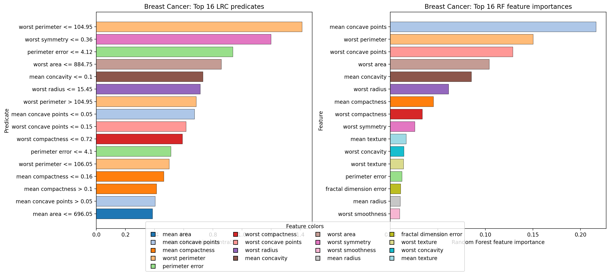
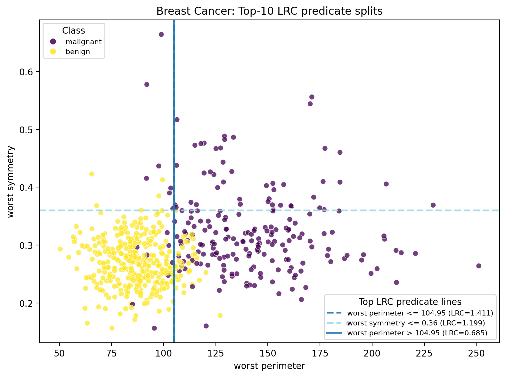
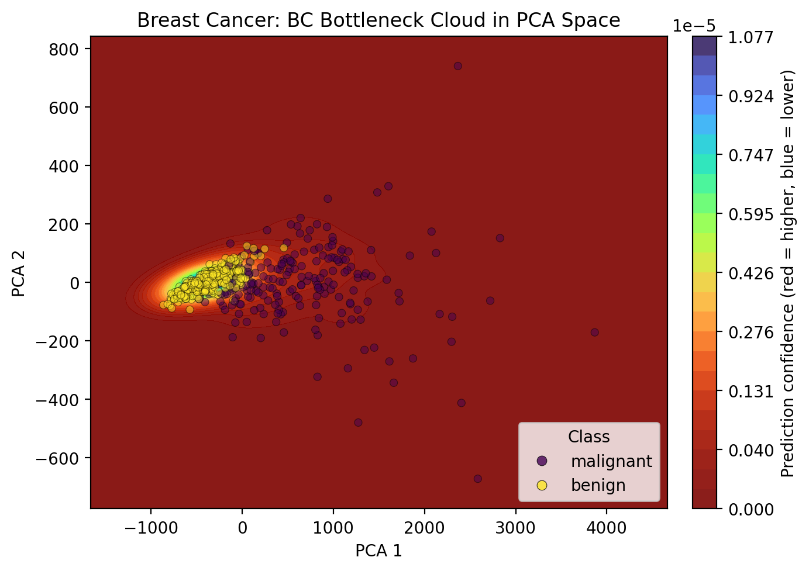
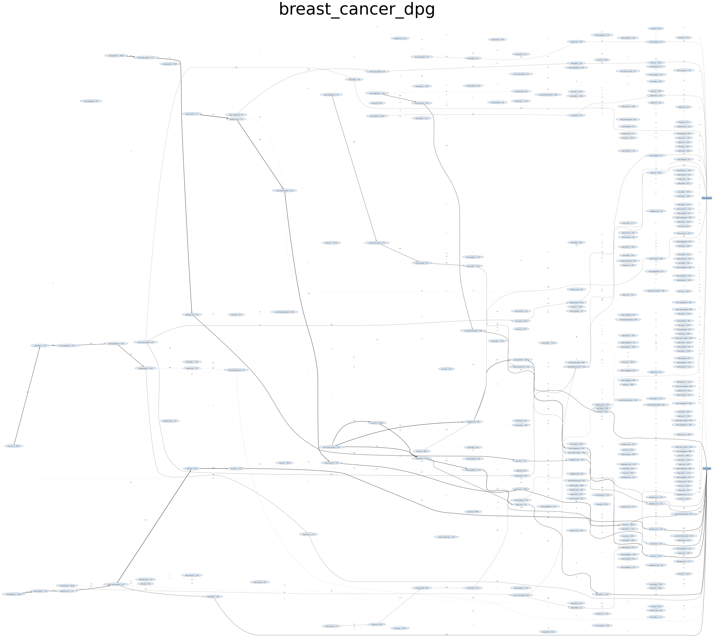
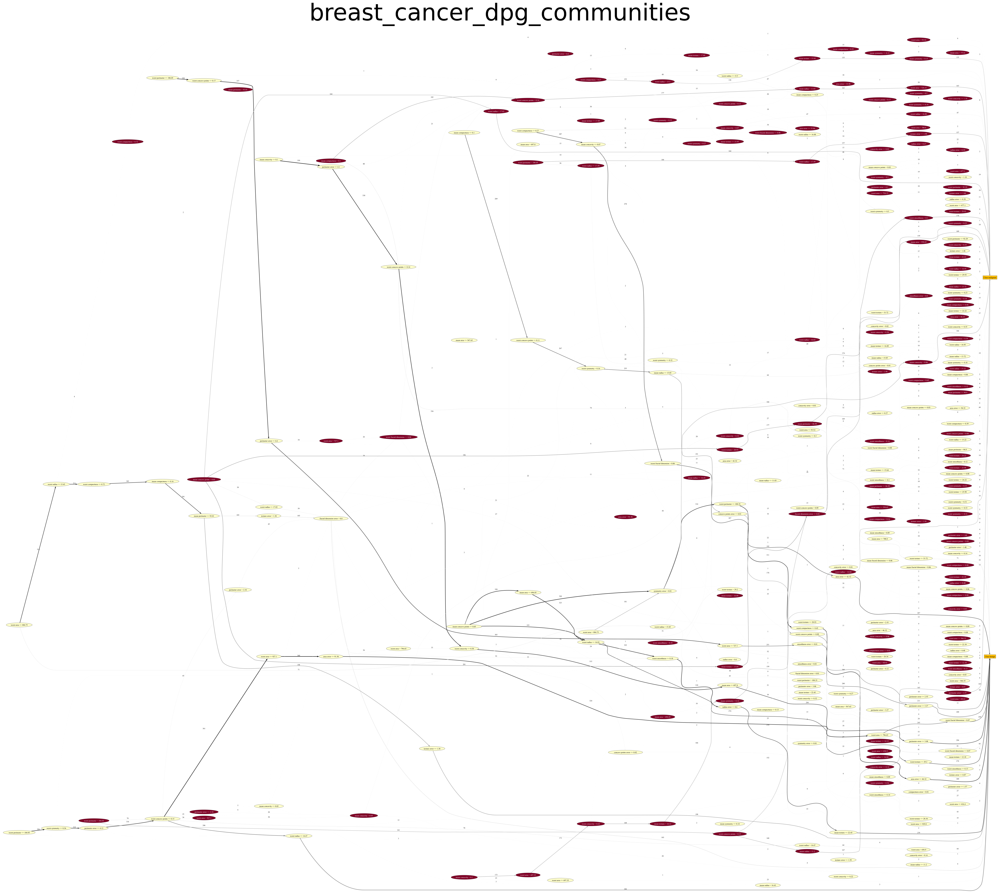
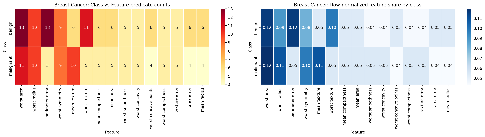
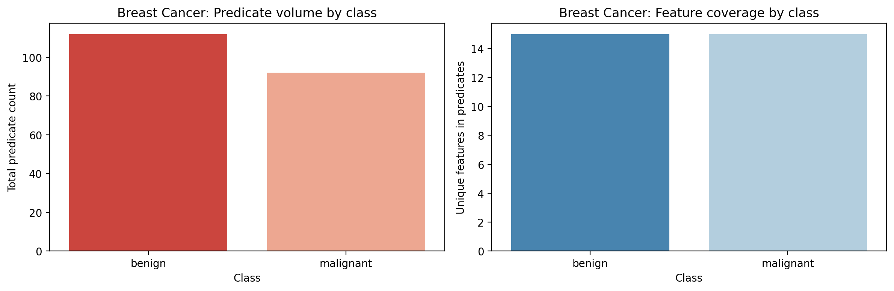
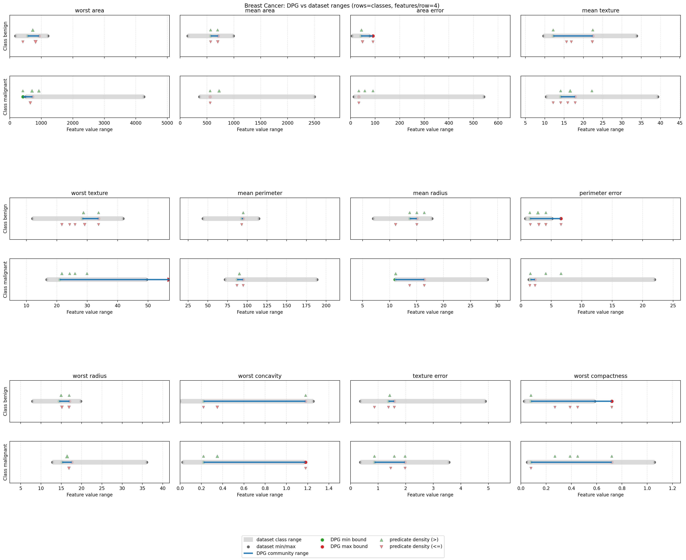

# DPGExplainer Saga Benchmarks — Episode 3: Breast Cancer

Episode 1 (Iris) established the baseline explanation workflow, and Episode 2 (Wine) stress-tested it under richer multiclass overlap.

Episode 3 applies the same protocol to Breast Cancer Wisconsin: a binary benchmark with higher dimensionality than Iris and Wine, where threshold interactions are dense and medically meaningful.

Pipeline:
1. Train baseline Random Forest.
2. Extract DPG.
3. Analyze LRC, BC, communities, overlap, and class complexity.
4. Validate DPG-induced ranges against empirical data ranges.

---

## 1. Baseline model sanity check


Confusion matrix (`rows=true`, `cols=predicted`):

```text
[[39  3]
 [ 4 68]]
```

Classification report:

```text
              precision    recall  f1-score   support

malignant         0.91      0.93      0.92        42
benign            0.96      0.94      0.95        72

accuracy                               0.94       114
macro avg         0.93      0.94      0.93       114
weighted avg      0.94      0.94      0.94       114
```

Model quality is strong enough for structural interpretation, with minor malignant/benign confusion still present.

---

## 2. Data geometry (feature-level intuition)

Because Breast Cancer has 30 features, we use a representative subset for pairwise visualization.


Compared with Iris and Wine:
- the feature space is larger,
- class separation exists but requires more interacting thresholds,
- local overlap motivates graph-level interpretation beyond single-feature ranking.

---

## 3. Why DPG on top of Random Forest

As in earlier episodes, RF importance alone does not explain global decision flow.

DPG adds:
- predicate-level nodes (`<=` / `>`),
- transition edges across tree paths,
- graph metrics to expose routing, bottlenecks, and modular class logic.

This is especially relevant in Breast Cancer, where multiple related shape/texture features co-determine class boundaries.

Implementation detail used in this run:
- `decimal_threshold=2` (from DPG config), so predicate thresholds are rounded to two decimals.
- This makes rules easier to read in tables/plots and improves communication without changing the modeling pipeline.

Example:

```python
explainer = DPGExplainer(
    model=model,
    feature_names=X.columns,
    target_names=bc.target_names.tolist(),
    dpg_config={
        "dpg": {"default": {"perc_var": 1e-9, "decimal_threshold": 2, "n_jobs": 1}}
    },
)
```

---

## 4. LRC vs RF importance (complementary views)



Top-10 LRC predicates:

| Predicate | LRC |
|---|---:|
| `worst perimeter <= 104.95` | 1.411381 |
| `worst symmetry <= 0.36` | 1.198727 |
| `perimeter error <= 4.12` | 0.937071 |
| `worst area <= 884.75` | 0.858048 |
| `mean concavity <= 0.1` | 0.731993 |
| `worst radius <= 15.45` | 0.712965 |
| `worst perimeter > 104.95` | 0.685177 |
| `mean concave points <= 0.05` | 0.673035 |
| `worst concave points <= 0.15` | 0.616178 |
| `worst compactness <= 0.72` | 0.590121 |

Top RF features:

| Feature | RF importance |
|---|---:|
| `mean concave points` | 0.216308 |
| `worst perimeter` | 0.150218 |
| `worst concave points` | 0.128881 |
| `worst area` | 0.104094 |
| `mean concavity` | 0.085259 |
| `worst radius` | 0.061277 |
| `mean compactness` | 0.045290 |
| `worst compactness` | 0.033751 |
| `worst symmetry` | 0.025696 |
| `mean texture` | 0.016796 |

Interpretation:
- strong overlap between top RF features and high-LRC predicates indicates coherent statistical and structural relevance,
- threshold-level details reveal the decision logic granularity hidden by feature-level summaries.

Improved RF vs LRC comparison:
- **8 of the top-10 RF features** also appear in the top-10 LRC predicates:
  `mean concave points`, `worst perimeter`, `worst concave points`, `worst area`,
  `mean concavity`, `worst radius`, `worst compactness`, `worst symmetry`.
- RF tells us *which features matter most globally*; LRC tells us *which exact thresholds route decisions*.
- LRC also exposes directional behavior not visible in RF ranking alone (for example, `worst perimeter` appears with both `<=` and `>` rules), indicating a central bifurcation boundary.



---

## 5. BC as bottleneck decision logic



Top BC predicates:
- `fractal dimension error > 0.0` (0.011913)
- `worst fractal dimension <= 0.08` (0.007774)
- `mean area <= 567.65` (0.007572)
- `mean concavity <= 0.05` (0.005225)
- `worst concave points <= 0.11` (0.005073)

BC highlights transition predicates that bridge dense model-routing zones where class assignment is less straightforward.

---

## 6. Global DPG and communities





Community view condenses many tree paths into interpretable decision modules and exposes how class-specific and shared predicate patterns interact.

---

## 7. Communities, overlap, and class complexity





Complexity summary (from notebook):
- `benign`: `159` predicates across `30` features.
- `malignant`: `122` predicates across `26` features.

What this adds:
- both classes use broad feature coverage,
- `benign` receives a larger rule budget in this model,
- overlap can be inspected through shared high-count features with class-specific density patterns.

---

## 8. DPG ranges vs dataset ranges



Boundary summary:
- `benign`: 30 modeled features, 28 finite lower bounds, 28 finite upper bounds.
- `malignant`: 26 modeled features, 22 finite lower bounds, 21 finite upper bounds.

Interpretation:
- Breast Cancer decision ranges are often asymmetric,
- one-sided constraints appear in several features,
- DPG boundaries provide a direct validation layer against empirical class ranges.

---

## 9. Main DPG contributions in this benchmark

1. Global rule topology (from isolated feature ranking to connected decision flow).
2. Predicate-level influence via LRC.
3. Bottleneck routing via BC.
4. Community-level class semantics.
5. Overlap diagnostics.
6. Class complexity profiling.
7. Boundary validation against dataset statistics.

Episode link:
- Iris showed the method on cleaner geometry.
- Wine extended it to richer multiclass overlap.
- Breast Cancer shows the same method handling binary logic with higher feature dimensionality than the previous benchmarks and dense threshold interactions.

---

## 10. References and related work

### Original DPG proposal
- Arrighi, L., Pennella, L., Marques Tavares, G., Barbon Junior, S.
  **Decision Predicate Graphs: Enhancing Interpretability in Tree Ensembles**.
  *World Conference on Explainable Artificial Intelligence*, 311-332.
  https://link.springer.com/chapter/10.1007/978-3-031-63797-1_16

### Extended DPG (Isolation Forest)
- Ceschin, M., Arrighi, L., Longo, L., Barbon Junior, S.
  **Extending Decision Predicate Graphs for Comprehensive Explanation of Isolation Forest**.
  *World Conference on Explainable Artificial Intelligence*, 271-293.
  https://link.springer.com/chapter/10.1007/978-3-032-08324-1_12

### Saga context
- Episode 1 (Iris):
  https://medium.com/@sbarbonjr/dpgexplainer-saga-benchmarks-episode-1-iris-c8816db2857d
