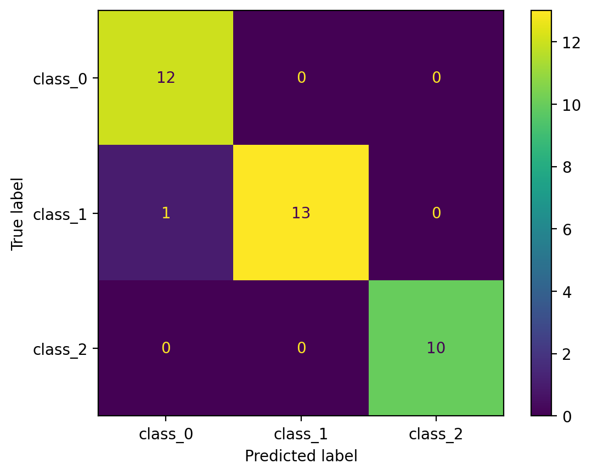
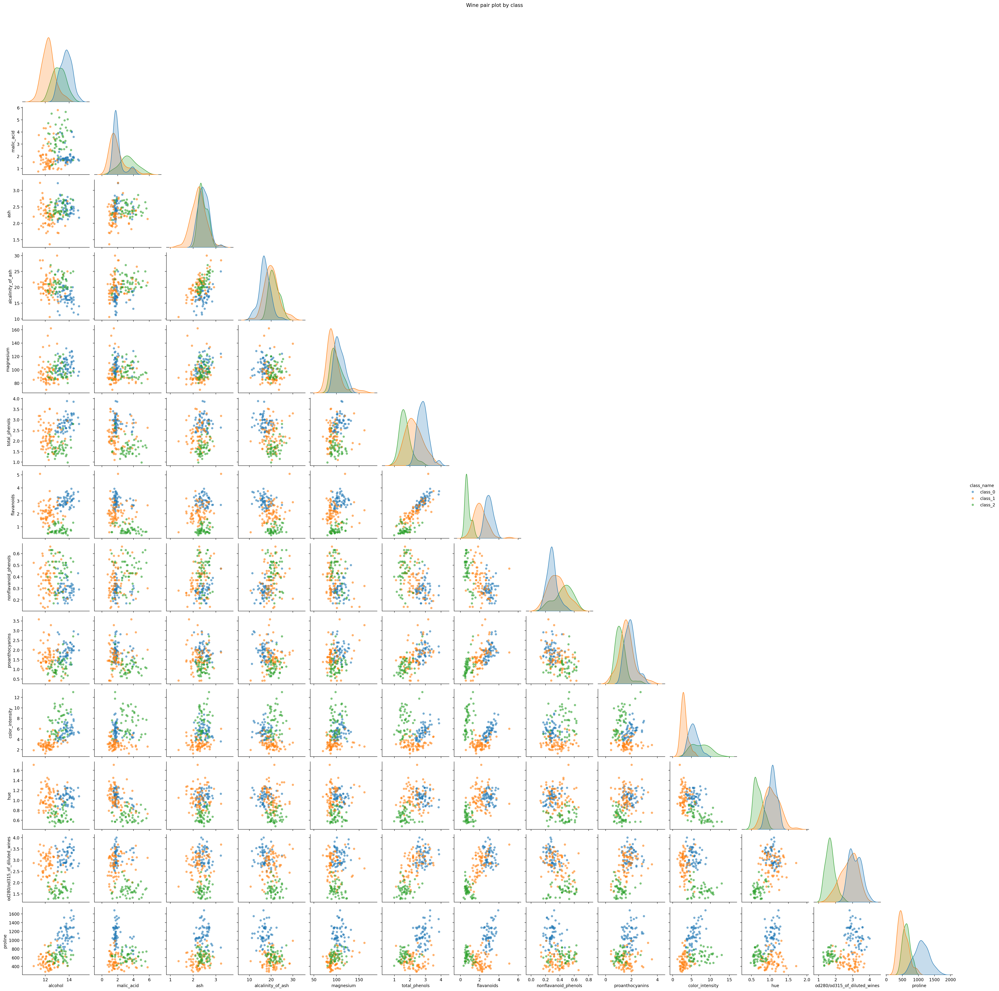
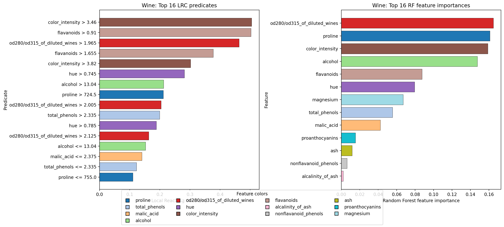
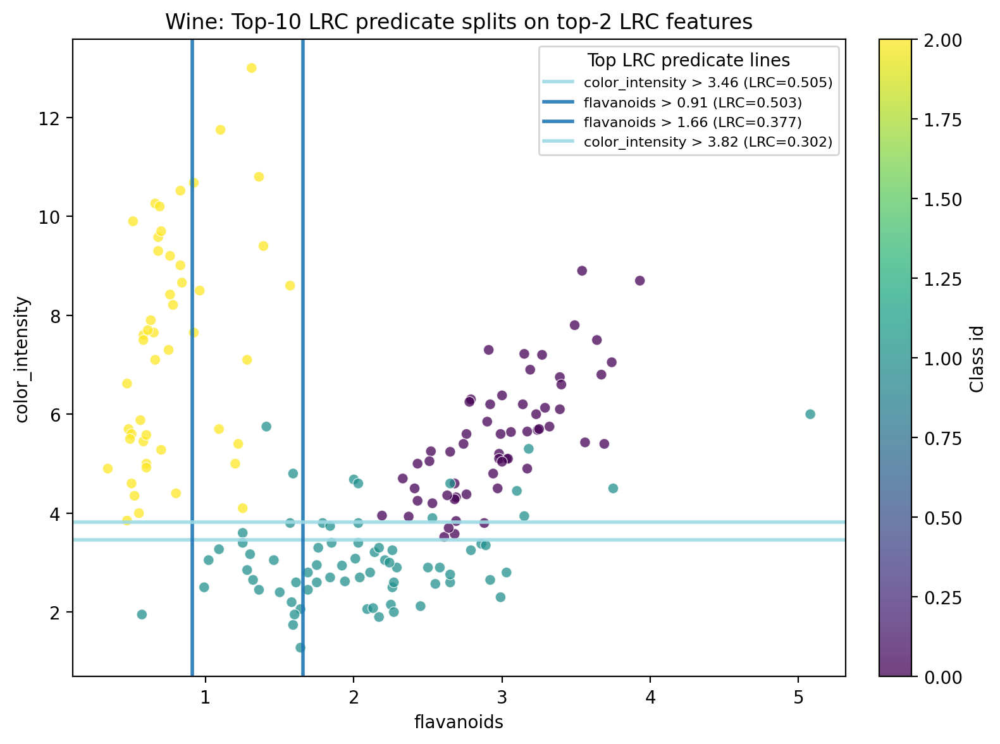
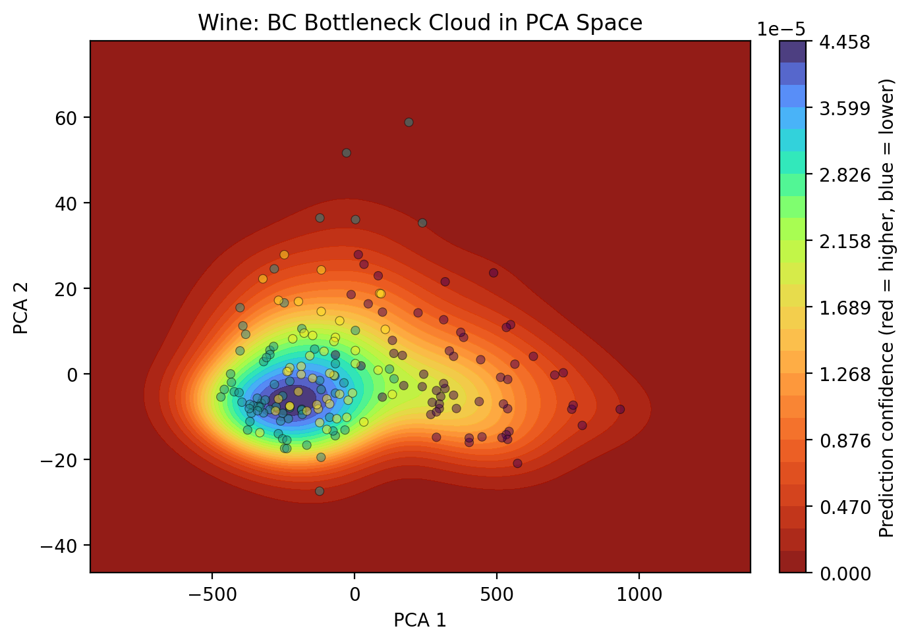
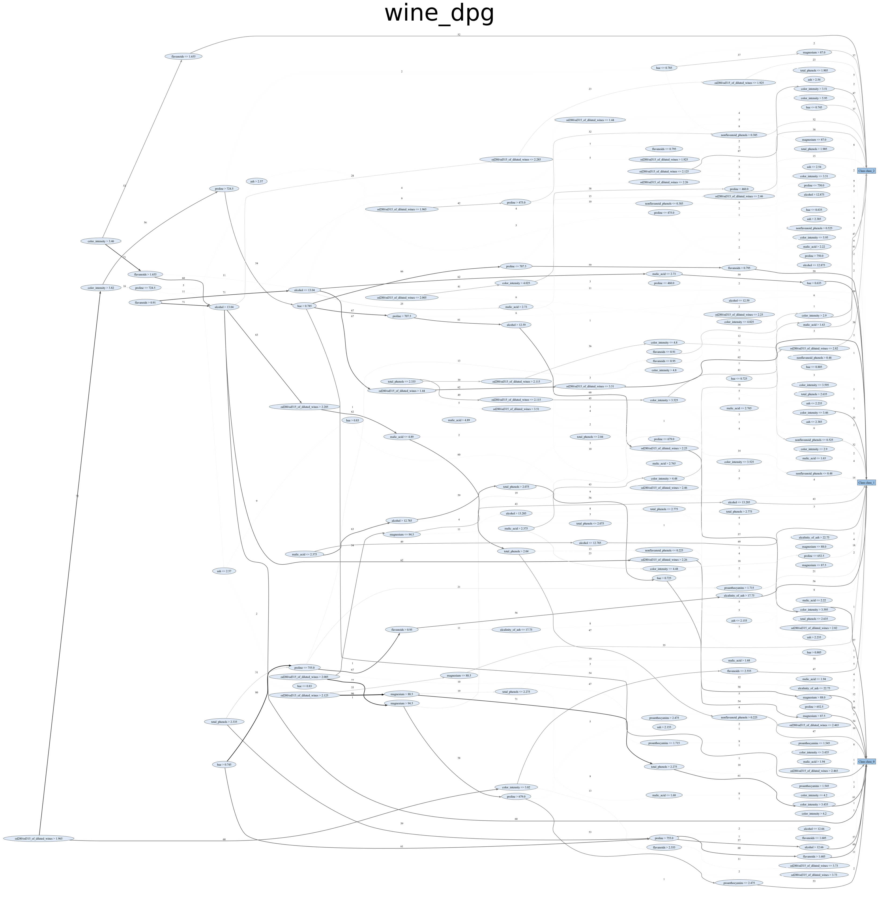
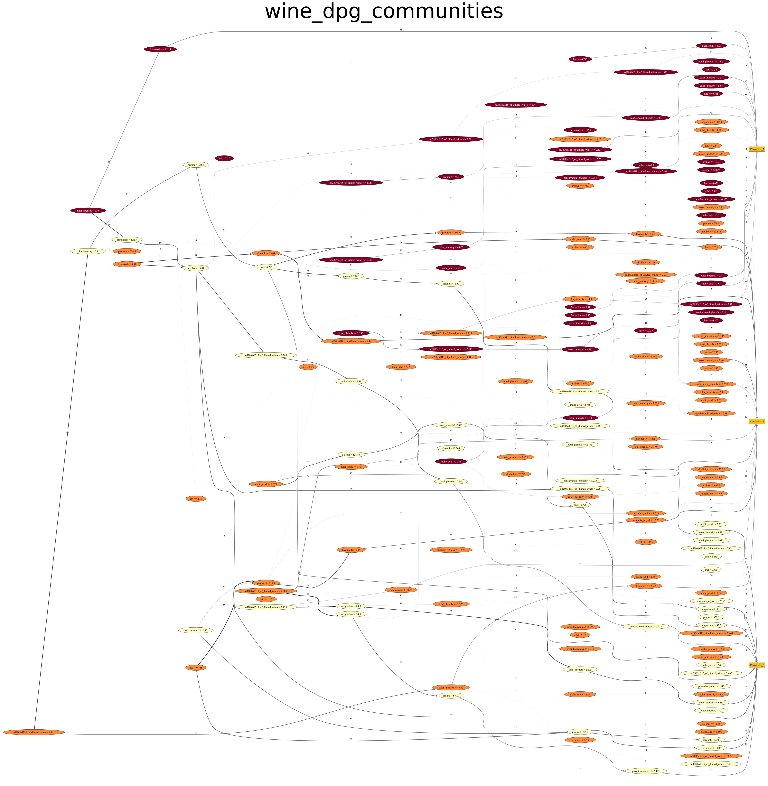
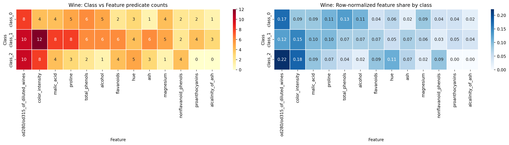
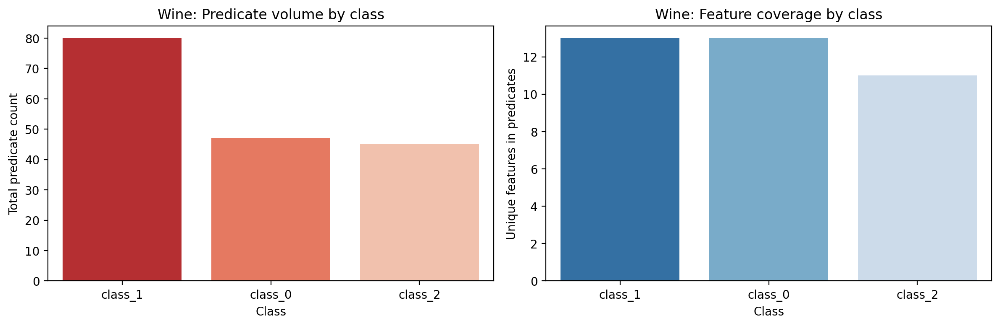
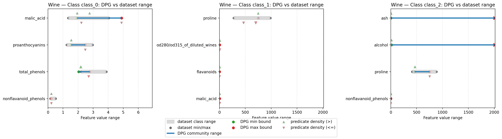

# DPGExplainer Saga Benchmarks — Episode 2: Wine

This is a compact global-interpretability report for a Random Forest on Wine using **Decision Predicate Graphs (DPG)**.

The pipeline is:
1. train a baseline Random Forest,
2. extract DPG,
3. analyze LRC, BC, communities, class boundaries, overlap, and class complexity,
4. compare DPG signals with dataset statistics.

---

## 1. Baseline model sanity check

Before graph analysis, we verify the classifier is doing something reasonable.

The confusion matrix checks baseline behavior for the three Wine classes (`class_0`, `class_1`, `class_2`) before graph interpretation. This is exactly the part DPG should help explain structurally.

---

## 2. Data geometry (feature-level intuition)

Pairwise feature distributions give the geometric baseline before any graph metric.

Wine has higher-dimensional and partially overlapping class geometry. The pair plot provides a visual baseline before structural DPG metrics.

---

## 3. Why DPG on top of Random Forest

Random Forest importance is good for ranking features, but it does not give explicit decision flow between concrete threshold predicates.

DPG converts trees into a global predicate graph:
- nodes: `feature <= threshold` / `feature > threshold`,
- edges: transitions observed in tree paths,
- metrics: structural role of predicates in global decision logic.

So the rationale is pragmatic:
- keep RF predictive strength,
- gain a graph view to inspect routing, bottlenecks, and class-rule organization.

---

## 4. LRC vs RF importance (complementary views)

LRC and RF importance answer different questions.

- **RF importance**: which features reduce impurity most across splits.
- **LRC**: which specific predicates are globally influential in downstream graph flow.

If a feature is high in RF and appears in high-LRC predicates, it is both statistically useful and structurally central.

To make this concrete, top LRC split lines are projected on the top feature pair:

This plot shows where high-LRC predicates cut the data manifold.

---

## 5. BC as bottleneck decision logic

BC highlights predicates that connect major decision regions.

Interpretation: high-BC predicates tend to concentrate around transition zones where class assignment is less trivial between Wine classes.

---

## 6. Global DPG and communities

Full graph view:

Community-colored view:

Communities represent coherent predicate themes. They help translate “many tree paths” into a smaller number of class-relevant rule groups.

---

## 7. Communities, overlap, and complexity (DPGExplainer-aligned)

Class-feature predicate concentration:

Class predicate volume and feature coverage:

What this adds:
- identifies which classes rely on broader or narrower predicate sets,
- exposes where classes share feature-rule patterns (overlap signal),
- provides a structural proxy for class simplicity/complexity.

Implementation note for this benchmark:
- community analysis follows `DPGExplainer` community output (`Clusters`) directly,
- `community_id` stays tied to a single DPG community,
- class-community association uses the cluster label when available (with fallback only when needed).

---

## 8. DPG ranges vs dataset ranges

This plot is now the main boundary-validation view and includes:
- dataset class ranges (gray reference),
- DPG community-derived ranges (blue),
- explicit unbounded-side markers (`-inf` / `+inf`) when one predicate side is missing,
- predicate-threshold density overlays, split by operator:
  - green for `>` predicates,
  - red for `<=` predicates,
  - close thresholds aggregated to emphasize dense decision zones.

Axis limits are computed from the most extreme values in scope (dataset and finite DPG bounds), with lower bound clamped to `0` when negative.

Why it matters:
- validates whether model-induced boundaries are consistent with empirical class spreads,
- shows where DPG uses narrower/wider intervals than raw data,
- reveals where many predicates concentrate, indicating high decision-detail regions.

---

## 9. Main DPG contributions in this benchmark

DPG extends standard RF interpretation with:

1. **Global rule topology**
   - from isolated feature ranking to connected predicate flow.

2. **Predicate-level influence (LRC)**
   - identifies which threshold rules organize model reasoning.

3. **Bottleneck routing (BC)**
   - isolates high-impact transition predicates in overlapping regions.

4. **Community-level class semantics**
   - class definitions as coherent rule ecosystems, not just split counts.

5. **Overlap diagnostics**
   - shared/ambiguous community structure marks naturally confusable Wine class zones.

6. **Class complexity profiling**
   - complexity as a structural property of predicate organization.

7. **Boundary validation against dataset statistics**
   - checks whether model-induced class ranges are consistent with empirical class distributions, including unbounded intervals and predicate-density concentration.

---

## 10. References and related work

### Original DPG proposal
- Arrighi, L., Pennella, L., Marques Tavares, G., Barbon Junior, S.
  **Decision Predicate Graphs: Enhancing Interpretability in Tree Ensembles**.
  *World Conference on Explainable Artificial Intelligence*, 311-332.
  https://link.springer.com/chapter/10.1007/978-3-031-63797-1_16

### Extended DPG (Isolation Forest)
- Ceschin, M., Arrighi, L., Longo, L., Barbon Junior, S.
  **Extending Decision Predicate Graphs for Comprehensive Explanation of Isolation Forest**.
  *World Conference on Explainable Artificial Intelligence*, 271-293.
  https://link.springer.com/chapter/10.1007/978-3-032-08324-1_12

### Real-life applications
- Systems:
  https://www.mdpi.com/2079-8954/13/11/935
- Computers and Electronics in Agriculture:
  https://www.sciencedirect.com/science/article/pii/S0168169926000979
